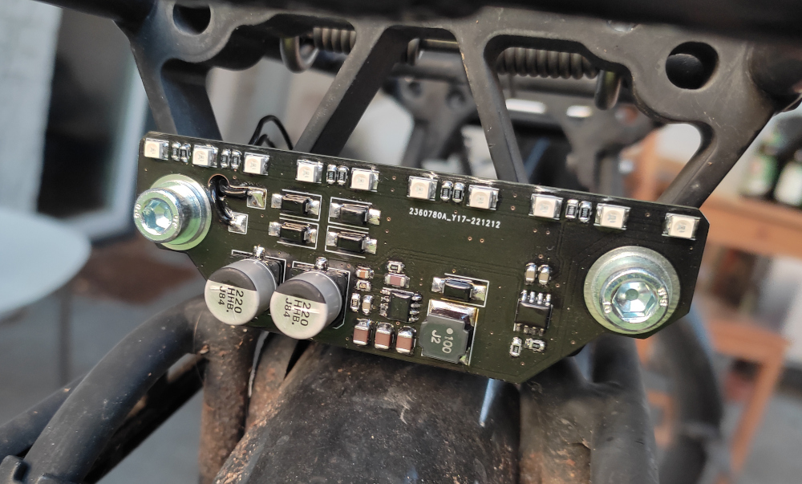

# simpleBicycleRearlight

It's was a quick project to get finally a working rear light for my bicycle. It uses 10x VLMK31R1S2 LEDs (red LEDs from VISHAY) driven with ~13mA constant current. The TS2509 Buck-Converter regulates the output voltage to get the constant current (see circuit diagram!).
PCB and Circuit was made with KiCad.

It works with a standard 6V bicyle dynamo. At my setup it's starts with flashing at slow cycle rotation and goes over to a constant brightness with higher rotations. The minimum needed voltage is about 3.5-4V (RMS).

The final assembly on my bicycle

Test with some green LEDs
